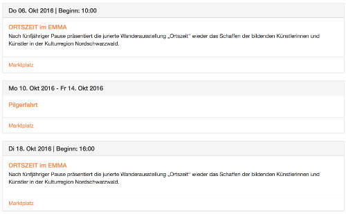

.. ==================================================
.. FOR YOUR INFORMATION
.. --------------------------------------------------
.. -*- coding: utf-8 -*- with BOM.

.. include:: ../_IncludedDirectives.rst

.. _introduction:

============
Introduction
============

Releases
--------

* Currently the source code is available at `Github <https://github.com/jweiland-net/events2>`_
* We have tagged all versions at Github and added a composer.json,
  so you can install different versions of |extension_key| with composer.

Bugs and Known Issues
---------------------

If you found a bug, it would be cool if you notify us
about that over the `Bug Tracker <https://github.com/jweiland-net/events2/issues>`_ of Github.

What does it do?
----------------

With this extension you can create single and recurring events. Further it is possible
to add and remove dates from recurring. Change time and description for a special
date. Multiple times for an event. Different times for a specified weekday.

.. _screenshots:

Screenshots
-----------

See |extension_key| in action.

Output Frontend
^^^^^^^^^^^^^^^

