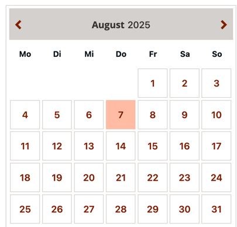

..  include:: /Includes.rst.txt

..  _introduction:

============
Introduction
============

What does it do?
================

Our events2 is a timeframe based event management system. That means, that only events within a predefined timeframe (e.g. all future events for the next 3 years)
are visible in Frontend. All newer/older events are still accessible, but there is no date calculated for them anymore.

Other than EXT:cal we have only one event record with a many flexible settings to dynamically calculate the day
records. If you change a description, only one event record needs to be updated.

You can create different types of events:

*   Single: An event for just one day
*   Duration: An event like 17.07.2025-20.07.2025
*   Recurring: An event that takes place more than one time. Examples are weekly food markets, theater performances, yearly recurring festivals, etc. For those recurring events you can specify dates like: "every Friday" or "3rd Monday of each month". You can also create exceptions for this rule, for example "every 4th Friday of the month, but not on December 24 (because it might conflict with christmas). Also for recurring events you could set an exception for the start/end time on a specific day, for example a theater play may be on Tuesday and Friday at 20:00, but on the date of the premier it will start on 20:30.
*   Events that have been cancelled can still be visible in the listing, but using a text with strike-through, so that visitors can see that it has been cancelled (and not just disappeared).

Examples of websites which use this extension
=============================================
*   https://www.pforzheim.de/veranstaltungen.html?tx_events2_list%5Baction%5D=list&tx_events2_list%5Bcontroller%5D=Day&cHash=aae93a2b6f03fe087901ca1c1389fcbd
*   https://www.drs.de/service/veranstaltungen.html
*   https://www.bapk.de/seminare-und-termine.html?tx_events2_list%5Baction%5D=list&tx_events2_list%5Bcontroller%5D=Day&cHash=aa3ac5e29651b2b46fd5954d15998be9
*   https://www.theater-pforzheim.de/spielplan.html

Screenshots
===========

See events2 in action:

Frontend Output
---------------

    Month calendar view, days with events in bold, current day highlighted

    List view of events

    Detail view of an event

..  figure:: ../Images/Introduction/search-box.png
    :width: 300px
    :align: left
    :alt: Search form for events
    Search form for events

    Backend form to enter recurring events

    Backend form to enter event details
